# Hi, I'm James

Backend Engineer focused on building practical services with Node.js, TypeScript, NestJS, and Nx.

I like backend work that is boring in the best way: clear boundaries, predictable APIs, maintainable modules, and systems that can keep growing without turning into a puzzle box.

## What I work with

- Runtime & language: Node.js, TypeScript
- Backend framework: NestJS
- Workspace tooling: Nx
- Database: PostgreSQL
- Containers: Docker

## Currently sharpening

I'm using [backend-forge-lab](https://github.com/JamesShr/backend-forge-lab) as a place to organize backend learning notes, experiments, and long-term practice topics.

Areas I am gradually digging into:

- Backend architecture, testing, error handling, and maintainability
- PostgreSQL fundamentals, query design, indexing, and reliability
- Distributed systems, idempotency, retries, and consistency tradeoffs
- Messaging, queues, event-driven design, and delivery guarantees
- DevOps basics, Docker-based workflows, CI/CD, and deployment flow
- Observability, backend security, and AI application backend patterns

## Building direction

I am slowly shaping a set of reusable backend project setup patterns: modular NestJS structure, Nx workspace conventions, database setup, Dockerized local development, and the kind of project bootstrap pieces I tend to repeat at work.

For now, this profile keeps the project list quiet while those ideas mature.

## GitHub snapshot

  
  

These cards are generated into this repository by GitHub Actions, so the profile does not depend on loading the live card service every time someone opens the page.

## Connect

